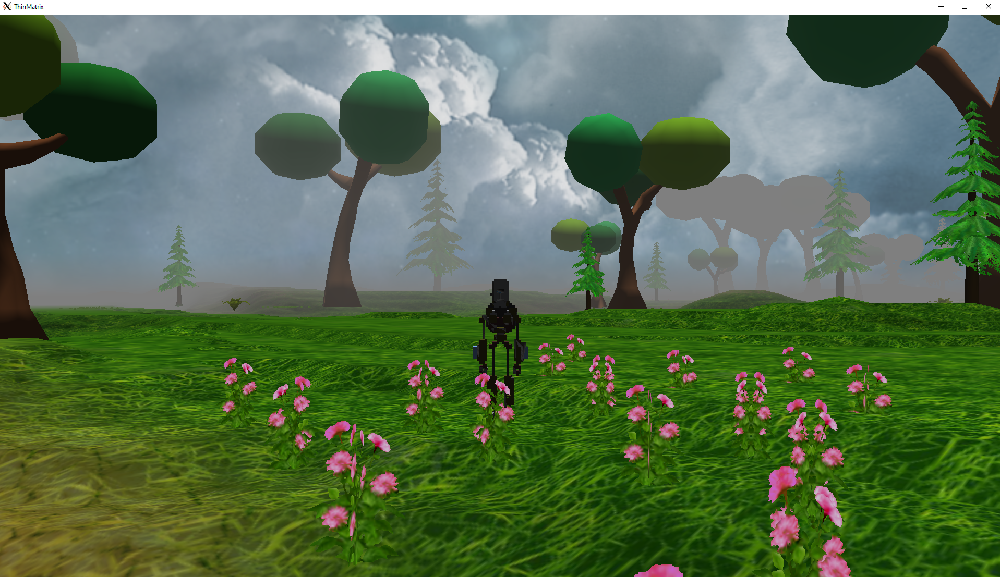

# 3D Game Engine

This repository contains a C++ port of the 3D Game Engine that was being
developed in the [OpenGL Tutorial Series](https://www.youtube.com/playlist?list=PLRIWtICgwaX0u7Rf9zkZhLoLuZVfUksDP)
by [ThinMatrix](https://www.youtube.com/channel/UCUkRj4qoT1bsWpE_C8lZYoQ).



## Development

This section will describe how to setup & build the project.

### Dependencies

This project has the following external dependencies:

- [CMake](https://cmake.org/)
- [GLFW3](https://www.glfw.org/)
- [GLEW](https://glew.sourceforge.net/)
- [GLM](https://github.com/g-truc/glm)
- [OpenGL](https://www.opengl.org/)

### Get the source

This project is hosted at: https://github.com/nrednav/game-engine

HTTPS:

```shell
git clone https://github.com/nrednav/game-engine.git
```

SSH:

```shell
git clone git@github.com:nrednav/game-engine.git
```

### Build

```
make compile
```

### Run

```
make run
```
